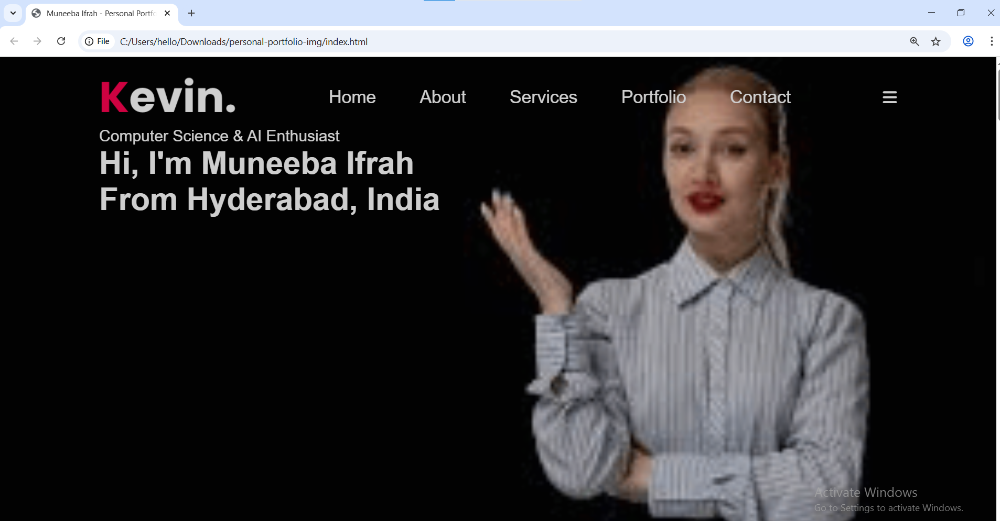

# Personal Portfolio

Welcome to my personal portfolio! This project showcases my skills, projects, and experiences in web development. This project is created and maintained by Muneeba Ifrah.

## 🧰 Technologies Used

* **HTML**: Structuring the web content.
* **CSS**: Styling the web pages.
* **JavaScript**: Adding interactivity to the website.

## 📁 Project Structure

```
/.vscode/           # VS Code settings
/images/            # Project images
file.js             # JavaScript functionality
index.html          # Main HTML file
style.css           # Stylesheet for the website
```

## 🚀 How to Clone, Run and Use

1. **Clone the repository:**

   ```bash
   git clone https://github.com/muneebaifrah/PERSONAL-PORTFOLIO-IMG.git
   ```
2. **Navigate into the project directory:**

   ```bash
   cd PERSONAL-PORTFOLIO-IMG
   ```
3. **Open the project in your preferred editor (VS Code recommended)**
4. **Run locally:**

   * Simply open `index.html` in your browser.
   * Make sure images and files are in the correct folders.

## ✨ Features

* Fully responsive design suitable for all screen sizes.
* Interactive JavaScript elements enhancing user experience.
* Clean and modern user interface.
* Easy to update and customize for personal use.

## 📸 Screenshots



## ⚡ Additional Info

* Created and maintained by **Muneeba Ifrah**.
* Can be freely used for personal portfolio showcase or learning purposes.
* All assets and code are organized for easy understanding and modification.
